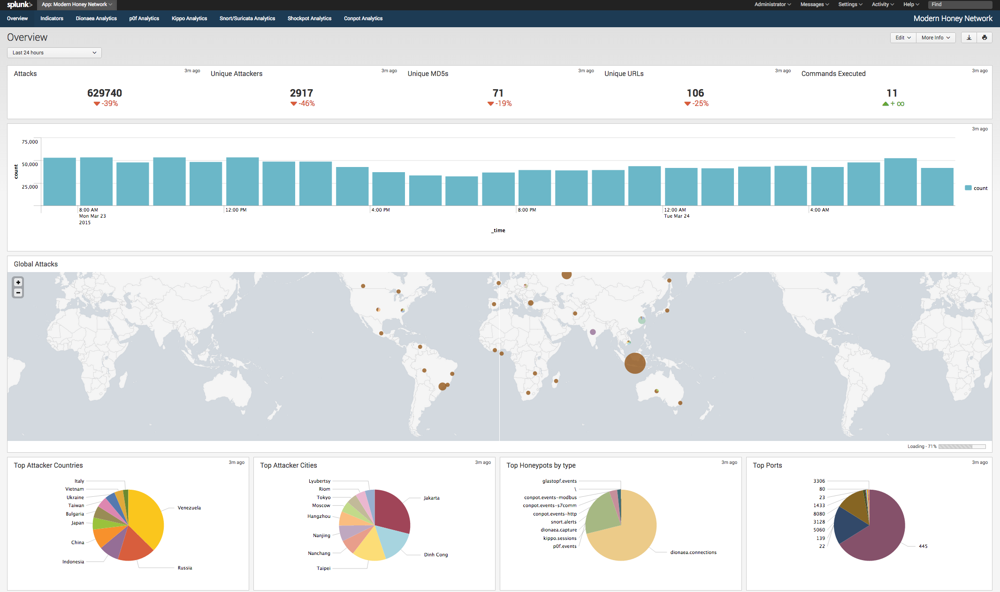

# Modern Honey Network Splunk App

The Modern Honey Network Splunk App is a set of purpose built dashboards and reports leveraging honeypot data collected by the [Modern Honey Network](https://github.com/threatstream/mhn) and [hpfeeds-logger](https://github.com/threatstream/hpfeeds-logger).



See the [screenshots](screenshots/README.md) for more info.

## Build the package

This builds a tarball named `mhn-splunk.tar.gz`.

```
./build.sh
```

## Installation

### On Splunk Search Head

1. Open Splunk
2. Visit the Apps management page
3. Click "Install App from file"
4. Choose the `mhn-splunk.spl` file and check the box next to "Upgrade app. Checking this will overwrite the app if it already exists."
5. Click the "Upload" button.

### On Splunk Forwarder

If your Splunk Indexer resides on a different server to the one you installed MHN, you will need to install a Splunk Forwarder to send MHN data from the MHN Server > Splunk.

1. Download and unpack the app to `SPLUNK_FORWARDER/etc/apps`
2. Copy `SPLUNK_FORWARDER/etc/apps/mhn-splunk/default/inputs.conf` to `SPLUNK_FORWARDER/etc/apps/mhn-splunk/local`
3. Edit `SPLUNK_FORWARDER/etc/apps/mhn-splunk/local/inputs.conf` and change `disabled=true` to `disabled=false`
4. Configure an `output.conf` file to tell the Splunk Forwarder where to send the data.
4. Restart Splunk

### Notes: [please ensure you have configured Splunk integration as documented here first](https://github.com/threatstream/mhn).

## LICENSE

mhn-splunk

Copyright (C) 2015 - ThreatStream Inc.

This program free software; you can redistribute it and/or
modify it under the terms of the GNU Lesser General Public
License as published by the Free Software Foundation; either
version 2.1 of the License, or (at your option) any later version.

This program is distributed in the hope that it will be useful,
but WITHOUT ANY WARRANTY; without even the implied warranty of
MERCHANTABILITY or FITNESS FOR A PARTICULAR PURPOSE.  See the GNU
Lesser General Public License for more details.

You should have received a copy of the GNU Lesser General Public
License along with this program; if not, write to the Free Software
Foundation, Inc., 51 Franklin Street, Fifth Floor, Boston, MA  02110-1301  USA
